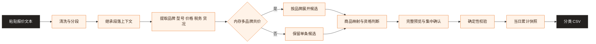

<div align="center">

# ⚡ WeChat Quote Extractor

### 算力之光专属 · 微信硬件报价整理 Skill

将聊天中不规则的 GPU、CPU、内存报价，整理为可审阅、可校验、可导入的行情 CSV


</div>

> [!IMPORTANT]
> 本项目为算力之光专属业务 Skill，面向硬件行情报价整理场景。仓库公开用于能力展示、版本协作与测试验证

## 它解决什么问题

真实报价通常来自聊天消息，表达方式不统一，价格、数量、税务状态、货况、仓库和型号经常混写。人工整理不仅耗时，还容易把数量当价格、把打码价格写入行情，或生成与后台商品字典不一致的产品名称

这个 Skill 将自然语言理解与确定性校验分开：模型负责理解上下文和提出候选，映射表与脚本负责控制哪些记录最终能够进入 CSV

| 原始问题 | 处理方式 |
|---|---|
| 一段文字包含多个品类或多条报价 | 先拆分候选，再按 GPU、CPU、内存分别生成文件 |
| 品牌、型号存在简称或常见别名 | 只自动使用已确认别名，其他疑似写法先提出候选 |
| 同一组规格由多个内存品牌共用价格 | 按语义展开为每个品牌一条记录，再分别匹配商品 |
| 价格、数量、DC 和频率混在一起 | 先提取字面信号，再判断数字的业务角色 |
| 当天多次整理容易产生重复文件 | 每批生成当日完整快照，并从当天最新快照继续累计 |
| 后台只接受固定五字段 | 输出前执行商品映射、字段校验、日期校验和去重 |

## 工作流程



处理过程分为四层：

1. **清洗层**：解码无害 HTML 实体、移除装饰字符、规范空格和换行，不改变业务信息
2. **理解层**：识别段落默认值、报价方向、产品身份、价格、税务状态和货况
3. **决策层**：根据商品表、已确认别名和用户当批确认，划分可导入、待确认和排除记录
4. **生成层**：脚本执行版本校验、商品校验、汇率校验、当日累计和 CSV 输出

## 核心业务规则

### 产品与品牌

- 当前支持 GPU、CPU 和内存；硬盘在分类编码与真实模板确认前不生成 CSV
- 结构化产品名必须与 [商品映射表](references/product-model-map.csv) 完全一致
- GPU 完成商品映射后，在最终 CSV 产品名型号前统一增加“英伟达”
- `SK` 归一为海力士，`MT` 和 `美光` 归一为镁光
- 未确认的品牌或型号修正不会被静默替换，只能提出候选或由用户确认当前批次
- CPU 缺少品牌时，可根据完整型号语义判断 Intel 或 AMD，但必须唯一匹配商品映射

### 内存多品牌共价

当多个可识别内存品牌明确共享容量、频率、价格、税务状态和货况时，自动展开为多条独立报价

```text
三星、SK 32G 4800 含税8200
```

会形成：

```text
三星 32G 4800    8200    含税    拆机
海力士 32G 4800  8200    含税    拆机
```

`/`、顿号、空格或“和、与、及”等连接方式都只是理解线索，不是固定触发列表。只有品牌位置和共享范围明确时才展开，不影响 CPU、GPU 列表或型号内部的分隔符

### 不纳入行情的内存特殊货

明确描述为“白牌”或“双标”的内存属于特殊货，不作为标准行情数据来源，也不会进入候选预览、累计快照或 CSV

```text
白牌 镁光 32G 5600 含税6800
三星联想双标64G 6400 含税7200
```

“双标”表示一条内存同时带有两个品牌标识，不属于多个品牌共用一个价格，因此该排除规则优先于多品牌共价展开

### 价格与税务

- 未标币种时默认人民币
- 明确售价和明确采购价都可以作为行情依据
- 仅有“麻烦报价”“有货带价”等请求而没有具体价格时，不构成行情
- `18x00`、`4X00USD` 等数字被遮挡的价格不进入 CSV
- `25800*10张` 表示单价与数量，不属于价格打码
- 税务状态只回答报价是否含税
- `含税不对应`、`含税票不对应` 等表达统一归为含税
- 当前只录入含税报价；未税、不含税和 `WS` 报价能够被识别，但暂不进入 CSV
- 缺少明确税务信号时不推断，记录进入待确认而不是 CSV

### 货况

| 品类 | 规则 |
|---|---|
| CPU、内存 | 只有明确标注全新才写全新，其他情况统一写拆机 |
| GPU | 普通 GPU 明确全新写全新，明确非全新写拆机，未说明时默认全新 |

`二手`、`拆新`、`拆机新`、`翻新` 和成色描述均按非全新语义归为拆机，不依赖固定词表

GPU 名称明确出现“整机”或“模组”时，按特殊形态处理；同类含义由模型判断，不维护封闭词表。特殊形态未标货况时暂不录入，疑似特殊形态但无法判断时先向用户确认

### 香港美元报价

香港仓美元报价按以下公式换算：

```text
美元报价 × 适用的 USD/CNY 人民币汇率中间价 × 1.13
```

- 汇率使用中国人民银行授权中国外汇交易中心公布的人民币汇率中间价
- 非交易日或当日尚未发布时，使用粘贴时间之前最近一次官方公布值
- 记录汇率值、实际发布日期和官方来源 URL
- 最终人民币报价按 Decimal half-up 四舍五入到整数
- 缺少汇率证据时不生成美元换算记录

## 当日滚动累计

每个时间目录都是截至当前批次的当日完整行情快照

```text
snapshots/
└─ 26-09-14/
   ├─ 26-09-14_09-00-00/
   │  ├─ 26-09-14_cpu.csv
   │  └─ 26-09-14_memory.csv
   └─ 26-09-14_14-30-00/
      ├─ 26-09-14_cpu.csv
      ├─ 26-09-14_gpu.csv
      └─ 26-09-14_memory.csv
```

- 仅使用同一天时间最新的快照作为历史基线
- 新日期先创建日期目录，再在其中新建时间目录，不覆盖或删除历史目录
- 本批未涉及的品类文件原样延续
- 跨日期不继承前一天数据
- 按产品名型号、报价、税务状态、货况四字段去重
- 日期时间不参与去重，四字段相同时保留日期时间更早的一条

## CSV 输出

每个分类文件只包含五个字段：

```csv
日期时间,产品名型号,报价,税务状态,货况
26/09/14/14:30,三星 32G 4800,8200,含税,拆机
26/09/14/14:30,海力士 32G 4800,8200,含税,拆机
26/09/14/14:30,英伟达 RTX 4090 24G 涡轮,25800,含税,拆机
```

数量、DC、内存布局、质保、包装方式以及发票是否对应，只用于理解原文，不进入最终 CSV 或长期结构化结果

## 快速使用

### 让 Codex 自动安装

复制下面这段提示词发送给 Codex，它会从本仓库下载并安装对应的 Skill：

```text
请从以下 GitHub 仓库下载并安装对应的 Skill：
https://github.com/liukun-cpdd/wechat-quote-extractor
```

安装过程中，如果 Codex 请求网络访问或写入本地 Skills 目录，请在确认仓库地址无误后授权

### 手动安装

也可以将本仓库克隆或复制到 Codex Skills 目录：

```text
~/.codex/skills/wechat-quote-extractor/
```

### 在 Codex 中调用

1. 在 Codex 输入框中输入 `/`，唤出可用的 Skill
2. 输入“微信报价整理”进行查找
3. 选择“微信报价整理”并确认
4. 直接粘贴需要处理的报价文本
5. Codex 会先给出完整预览，并集中询问仍需确认的问题
6. 生成 CSV 时，如果快照输出根目录尚未明确，Codex 会提示你选择或确认一个目录

快照根目录确认后，后续同日批次会自动从该目录中的当日最新快照继续累计，不需要每次重新选择

确认结构化结果后，可运行确定性生成器：

```powershell
python scripts/build-import-csv.py --input <records.json> --snapshot-root <confirmed-snapshot-root>
```

输入协议详见 [结构化 Schema](references/structured-schema.md)，完整业务判断详见 [业务规则](references/business-rules.md)

## 项目结构

```text
wechat-quote-extractor/
├─ SKILL.md                      # Skill 入口与执行边界
├─ agents/openai.yaml            # Codex 展示信息
├─ assets/import-template.csv    # 五字段导入模板
├─ references/
│  ├─ business-rules.md          # 业务规则
│  ├─ structured-schema.md       # 结构化协议与 CSV 契约
│  ├─ examples.md                # 典型输入与判断示例
│  ├─ product-model-map.csv      # 可导入商品映射
│  ├─ brand-alias-map.csv        # 已确认品牌别名
│  ├─ tax-alias-map.csv          # 已确认税务别名
│  ├─ release-manifest.json      # 统一版本清单
│  └─ release-process.md         # 反馈与发布流程
├─ scripts/
│  ├─ build-import-csv.py        # 校验、累计和 CSV 生成
│  └─ refresh-product-map.py     # 商品映射更新工具
└─ tests/test_build_import_csv.py
```

## 设计边界

- 不创建联系人对象，不保存微信聊天历史
- 不把模型猜测直接写入商品映射或共享别名
- 不将待确认、未映射或无效记录写入 CSV
- 不自动上传行情后台，除非用户另行提出并明确授权
- 单次确认只作用于当前批次，正式规则变更必须经过统一版本发布

## 验证与版本

```powershell
python -X utf8 -B -m unittest discover -s tests -v
```

当前版本 `v0.6.2`，共 39 项自动化测试。版本变更、字典更新和同事分发遵循 [统一发布流程](references/release-process.md)

---

<div align="center">

**算力之光专属 · 让非结构化报价成为可验证的行情数据**

</div>
